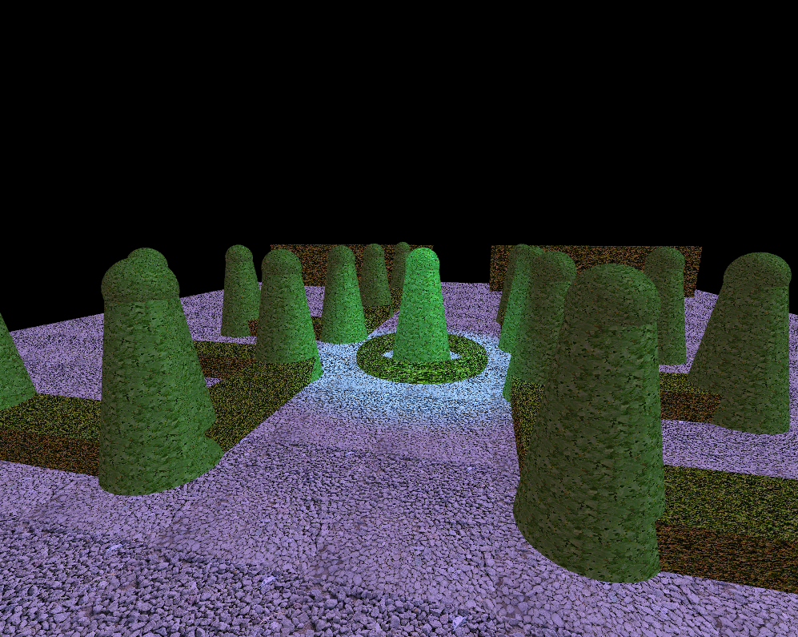
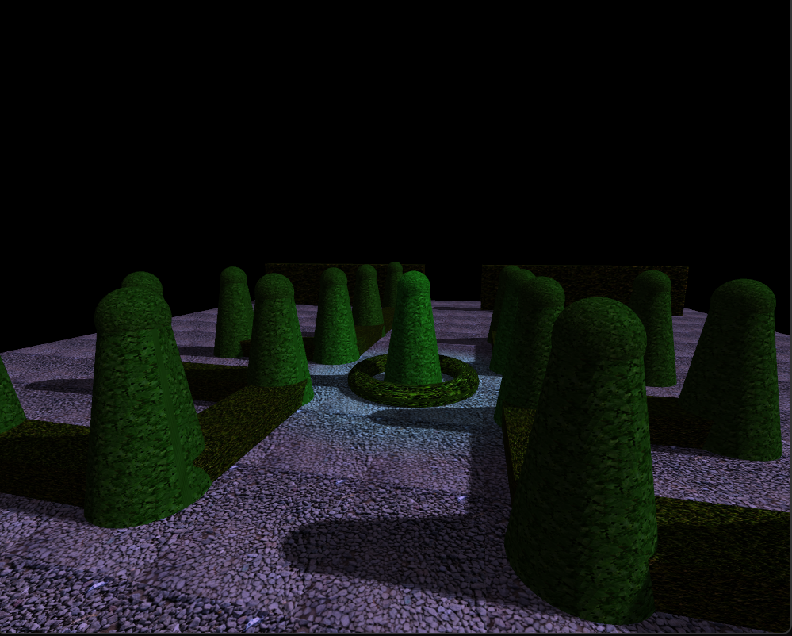
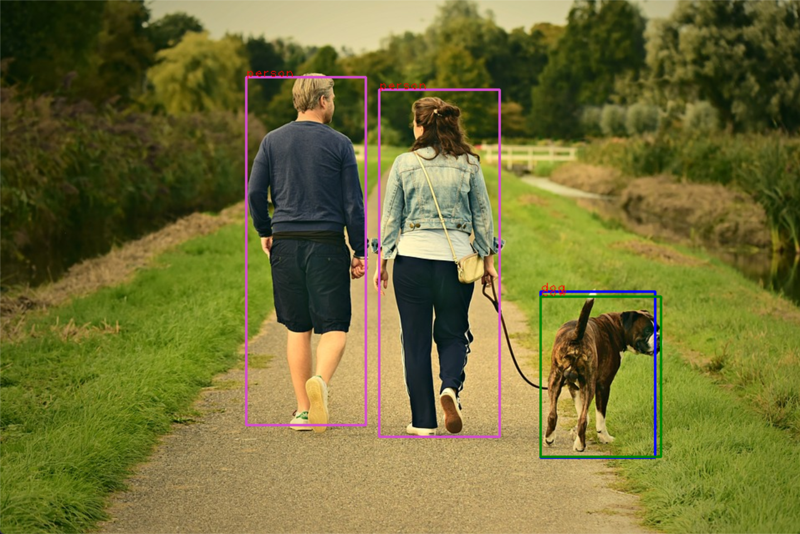
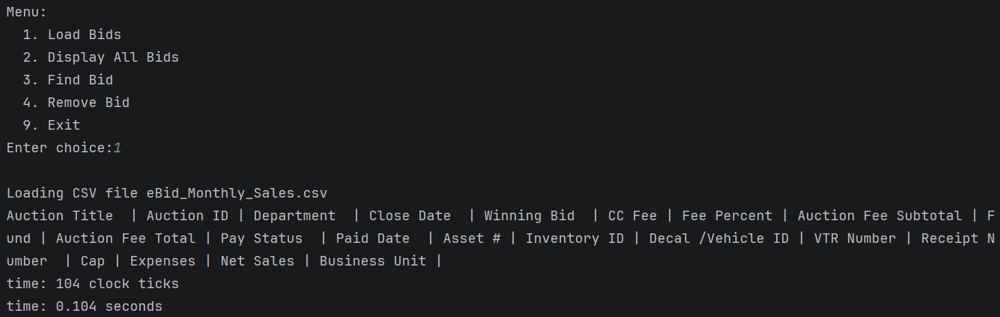
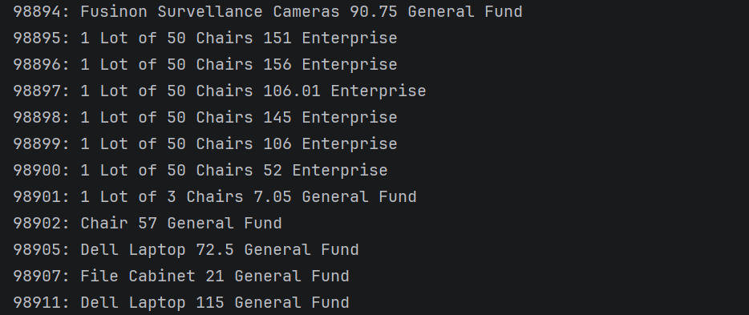
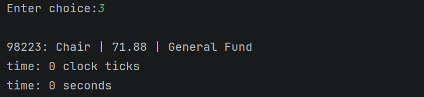

<link rel="preconnect" href="https://fonts.googleapis.com">
<link rel="preconnect" href="https://fonts.gstatic.com" crossorigin>
<link href="https://fonts.googleapis.com/css2?family=Playpen+Sans:wght@100..800&display=swap" rel="stylesheet">
<meta name="viewport" content="width=device-width, initial-scale=1">
<link rel="stylesheet" href="styles.css">

<!-- Floating particles background -->

# Ronny Valtonen
Hi! I am Ronny Valtonen, I was originally born in Finland and began pursuing a bachelors in Computer Science. Ever since I built my first very own computer, I fell in love with technology and the back bone on how the hardware runs. I began taking computer science related classes in high-school and soon began studying computer science in Washington State University. I have coded many programs in various programing languages. I also have experience with computer hardware and have built many computers for clients that have wanted a computer for use.

> Focused on performance-driven systems, data structures, and secure, maintainable software.  
> Experience with C++, Python, OpenGL, Machine Learning, and database-backed applications.
> Work experience in hardware validation.

📍 Oregon, USA
🔗 [GitHub](https://github.com/FinnishArmy)
📄 [Resume](https://docs.google.com/document/d/1HQ7J6HudQm84iyurnk3WpXiCVznRwxff/edit?usp=sharing&ouid=107508688339607012837&rtpof=true&sd=true)
💼 [LinkedIn](https://www.linkedin.com/in/ronny-valtonen/)

Graduated from Southern New Hampshire University in 2026 with Bachelors of Computer Science

<h1 align="center"> CS499 Capstone </h1>

<h2 align="center"> Self Assessment </h2>

Completing an ePortfolio throughout this final CS499 course has shown me everything I've personally completed. Not only does this help showcase my ability to professionaly represent my skillset as a computer scienstist, but it also showcases to myself what I have accomplished. Being able to complete an informal code review while still keeping a formal tone highlights my skills to verbally and visually deliver coherent and technically sound communications.

<break>

<h3> Software Design and Engineering </h3>

My enhancement one is a representation of my abilities to work on OpenGL in C++ and showcases my skills in software engineering. This project is a strong representation of my software design and engineering abilities as it required building a maintainable system rather than just rendering graphics. It was a structured project with having to program shaders, objects, lighting and GPU resource handling. I designed a modular architecture that separated each of these core pieces to improve scalability originally which gave me the ability to easily enhance the project when I came back. Debugging rendering pipeline issues also strengthened my ability to diagnose problems in software stacks.

<break>

<h3> Algorithms and Data Structure </h3>

For the algorithms and data structure category, I chose my machine learning program developed during CS 260 at WSU. This demonsrates my wability to apply algorithmic principles to data-driven problems. The artifact showcases my use of arrays, lists and iterative optimization techniques to process data, train models and evaluate performance. Through the enhancements, I imrpvoed efficiency and clarity of the algorithmic logic, refactored code for better modularity and provided clear documentation of said enhancements. This reinforced my understanding of trade-offs between performance and efficiency by allowing the program to dynamically scale based on hardware capabilities.

<break>

<h3> Databases </h3>

For the databases category, I included my DAD220 final project as it focuses on importing, querying and managing a structured database (CSV) using SQL concepts. The artifact highlights my ability to design and interact with relations data models, validate data, perform security checks and execute queries that support good analysis of said data. Through the enhancement process, I imrpvoed efficiency by switching to a self-balancing tree (Red-Black BST), added error handling and input validation and strengthened data integrity. These enhancements reflect a security-minded appracoh to database design. The project demonstrated my proficiency with database technology and my ability to apply database principles to real-world applications.

 Table of Contents 
- [Code Review](#-code-review-)
- [Software Design / Engineering](#enhancement-one---software-design--engineering)
- [Algorithms and Data Structures](#enhancement-two---algorithms-and-data-structure)
- [Databases](#enhancement-two---databases)
- [Self Assessment](#-self-assessment-)

<h2 align="center"> Code Review </h2>

  <video controls>
    <source src="sources/CS-499-CodeReview-Valtonen.mp4" type="video/mp4">
    Your browser does not support the video tag.
  </video>

<h2 align="center"> Enhancement One - Software Design / Engineering </h2>

The origin of this project is from CS-330, Computer Graphics and Visualization which was programming in OpenGL to create a 3D scene based on a chosen 2D image.  The plan for this project enhancement was to improve the software design by utilizing more advanced lighting and shadow mapping techniques in order to create a more realistic 3D environment within the OpenGL application. In the current design, it uses the most basic form of lighting model which is Phong (LearnOpenGL). The enhancement introduced Blinn-Phong which is more realistic as well as implementing Shadow Mapping to calculate the ambient occlusions made by physical objects that occlude a light source.

Repo: https://github.com/FinnishArmy/Computational-Graphics-and-Visualizaiton

<h2 align="center"> Enhancement Two - Algorithms and Data Structure </h2>
The origin of this project is from a machine learning course taken in Washington State University.  The purpose of the program is to feed an image through a network and properly identify objects within an image using Python.  I chose to enhance this project as it required advanced knowledge on which post-processing algorithm to utilize and having the ability to pick the highest scoring detections.  I also used it to showcase my ability to highlight the skills on algorithmic optimization.  Finally I chose this project to show my ability on using the right data structures for the right operations to increase efficiency.

Below you can see how the algorithm draws a rectangle around each detect object.

During runtime, the program automatically calculates the number of threads it can use, if OpenCV hardware is available and attempts to utilize the GPU if available. This way the inference works on integrated systems like traffic cameras or high performance desktop computers with a dedicated graphics card.

Repo: https://github.com/FinnishArmy/ML_Image_Identification

<h2 align="center"> Enhancement Three - Databases </h2>
The purpose of this project was to develop a binary search tree data structure in order to sort through a CSV database.  This was originally completed in Data Structures at SNHU in C++.  I chose this project as it aligns closely with the enhancement topic and to showcase my ability to enable an efficient use of a BST within C++ and to enhance the project by patching security vulnerabilities.  I used various static analysis tools such as Clang-Tidy and ReSharper to reveal possible vulnerabilities within the code base (CSVparser.cpp and BinarySearchTree.cpp).  Once these suggestions were revealed, it was my job to ensure they were not false-positives and to patch the ones that indeed were vulnerabilities or possible enhancements.  One big issue was not having a default clause within a switch-case, this could lead to unexpected behavior (though not in this scenario) if the code was used elsewhere.  Another repeated issue that led to efficiency problems was locations where the parameter was copied for each invocation, this led to an improvement in speed of the BST.

Overall, I think this project showcases my abilities to choose the correct data structure for databases.  Showing my ability to convert a previously implemented Binary Search Tree to a Self-Balancing Binary Search Tree highlights my skills in keeping code modular and working on previously written code.  I also showed my skills in using static code analysis tools like Clang-Tidy to reveal possible code vulnerabilities and patch ones that are not false positives as well as ignoring ones that are false positives.  I also removed many warnings that previously existed in the code from 15+ to only 1 warning that can be safely ignored.  For these reasons I believe this program enhancement matches the course outcomes for Data Structures and Algorithms.

Seen below is the functionality of loading the database, display all bids and deleting the entry from the database.

Repo: https://github.com/FinnishArmy/BST_CPP